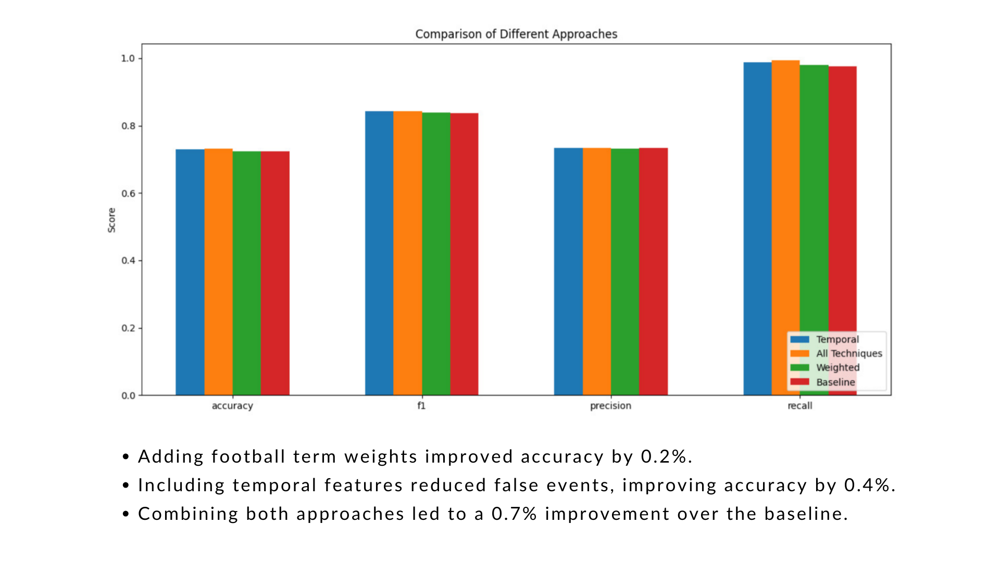

# Sub-event Detection in Twitter Streams


## Overview

This project detects important football match moments (“sub-events”) from Twitter in real time.  
When something happens - like a goal, penalty, or red card - fans post tweets instantly. By processing these tweets, the system can automatically identify when an event occurs.

**Example:**

- `"GOOOOAL!! Messi scores ⚽🔥 #Argentina"` → Important event
- `"Watching the match with friends"` → Not an important event

The challenge: tweets are short, informal, and full of noise - from ads and spam to unrelated chatter. Our solution combines **domain-specific text preprocessing**, **time-based features**, and a **custom deep neural network** to filter noise and detect real events.

---

## Preprocessing

We created a custom `TweetPreprocessor` to handle sports-specific content.


**Steps:**

1. Lowercase all text
2. Remove promotional/advertising content
3. Extract words from hashtags
4. Remove URLs
5. Keep match scores but remove other numbers
6. Replace emojis with words (`⚽` → "goal")
7. Normalize elongated words (`goooaaal` → `goal`)
8. Remove punctuation and special characters
9. Replace abbreviations (`YC` → `yellow card`)
10. Remove stopwords
11. Lemmatize words to their base form


---

## Feature Engineering

We used:

1. **Word embeddings** - GloVe vectors, with extra weight for key football terms.
2. **Temporal patterns** - Tweet counts per minute to detect spikes.

Results of different feature combinations:



- Adding football term weights → **+0.2% accuracy**
- Adding temporal features → **+0.4% accuracy**
- Combining both → **+0.7% accuracy over baseline**

---

## Model Architecture

Our best model: a **Custom Neural Network**.


**Details:**

- Dense layers: `512 → 256 → 128 → 64`
- ReLU activation
- Batch normalization, dropout (0.5), L2 regularization
- Sigmoid output for binary classification
- Adam optimizer, binary cross-entropy loss
- Early stopping for better generalization
- Hyperparameter tuning with RandomizedSearchCV

---

## Performance


- 77.57% accuracy on test set
- 72.65% on public leaderboard
- 71.15% on private Kaggle leaderboard

---

**ROC Curves:**  


**Accuracy:**  


**Metrics & Resource Usage:**  


Key points:

- Custom Neural Network → highest accuracy, but heavier on time/memory.
- SVM → nearly as accurate, more efficient.
- Logistic Regression → fastest, but less accurate.

---

## Installation

```bash
pip install tensorflow nltk pandas numpy gensim scikit-learn joblib

```

Download required NLTK data:

```python
import nltk
nltk.download('stopwords')
nltk.download('wordnet')
nltk.download('punkt')
nltk.download('punkt_tab')
```

---

## How to Run

1. Place your CSV files in:
   - `train_tweets/` for training data
   - `eval_tweets/` for evaluation data
2. Run:

```bash
python main.py
```

**Output:**

- Preprocessed datasets
- Trained model
- Predictions in `new_predictions.csv`
- Analysis in `analysis_output/`

---

## References

- Agrawal & Singhal (2019) - Text preprocessing for Twitter
- Huang & Shen (2018) - Event summarization from sports tweets
- Aloufi & El Saddik (2018) - Sentiment in football-specific tweets
- Devlin et al. (2018) - BERT for language understanding
- Dingwall & Potts (2018) - Mittens: GloVe extension for domain-specific embeddings
